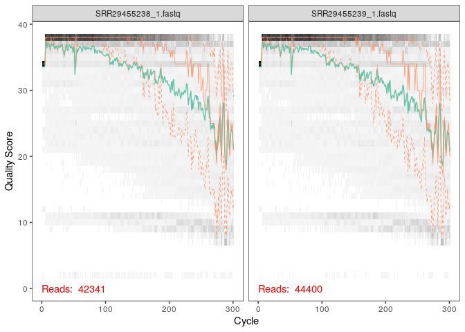
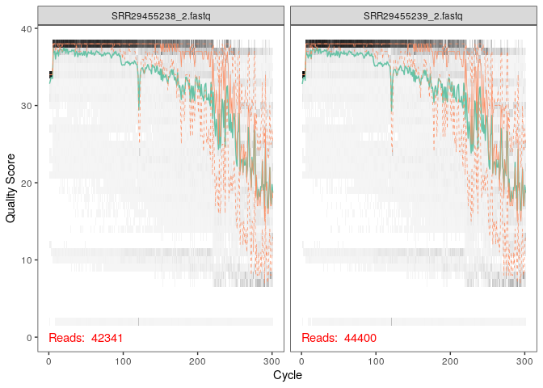
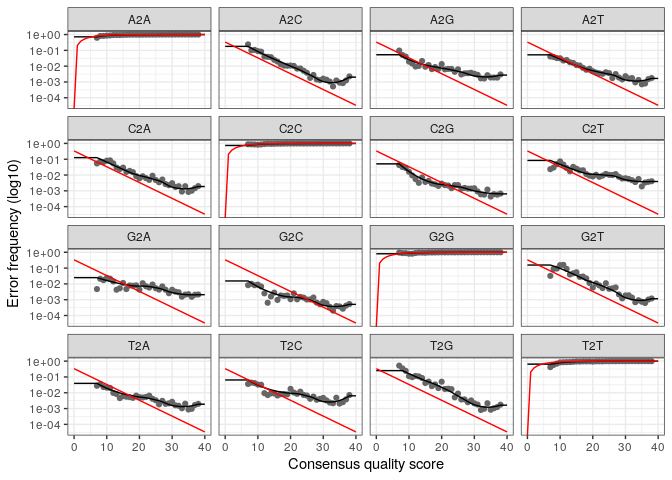
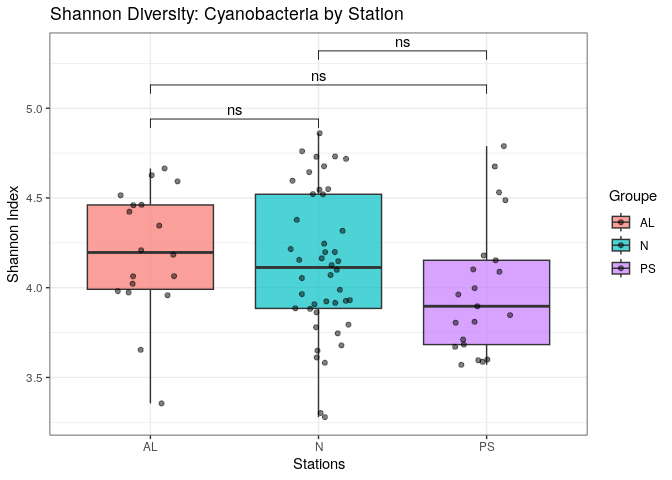
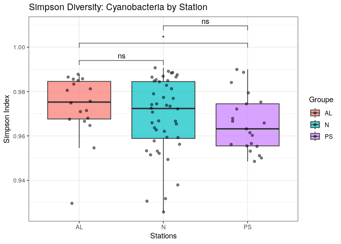
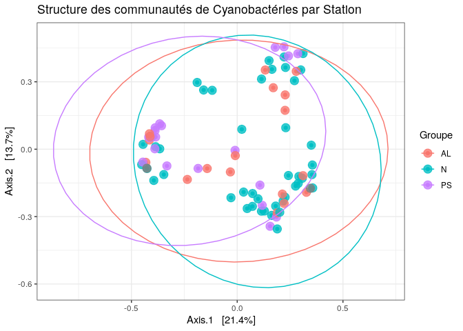
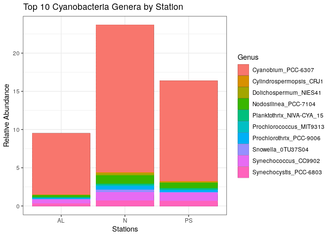

Article_ADM_AngeliquePARISOT
================
2025-10-05

# Nouvelles perspectives sur les picocyanobactéries et la diversité cyanobactérienne sous-étudiée du système d’Albemarle Pamlico Sound, Caroline du Nord, États-Unis

Joel Sánchez-Gallego, Nathaniel P. Curtis, Hans W. Paerl et Ryan W.
Paerl

## Introduction

Les cyanobactéries sont une composante du phytoplancton. Retrouvées dans
de nombreux milieux aquatiques, ces bactéries photosynthétiques jouent
un rôle essentiel dans les écosystèmes et sont des acteurs principaux de
la production primaire. Outre leur implication dans la production
primaire, les cyanobactéries sont la source d’une variété de métabolites
secondaires et sont souvent indicatrices de changements
environnementaux.

Bien que les écotypes de cyanobactéries pélagiques marines et
dulçaquicoles soient les mieux étudiés, de récentes études ont mis en
évidence l’existence d’écotypes estuariens, qui présenteraient des modes
de vie distincts.

Le système de l’Albemarle-Pamlico Sound (APES), deuxième plus vaste
estuaire du territoire continental Américain, constitue un continuum eau
douce - eau salée, idéale pour étudier la diversité de cyanobactéries en
milieu estuarien.

Cette étude est basée sur 4 grands axes principaux: 1. Étudier la
diversité de cyanobactéries, via le séquençage de l’ARNr 16S à partir
d’échantillons prélevés dans différentes parties de l’APES. 2. Évaluer
la contribution des picocyanobactéries à la biomasse phytoplanctonique.
3. Identifier des écotypes potentiels et comprendre comment les
variables environnementales influencent la composition de ces
communautés. 4. Détecter la présence de genres potentiellement
producteurs de toxines.

Les analyses effectuées ici porteront uniquement sur l’étude de la
diversité de cyanobactéries de l’APES.

## Matériel et méthodes

### Récolte des échantillons

Des échantillons d’eau de surface ont été prélevés aux stations de
l’estuaire de la rivière Neuse (N) et de l’estuaire du Pamlico Sound
(PS) dans le cadre du projet de modélisation et de suivi de l’estuaire
de la Neuse (ModMon) (Luettich et al., 2000 ; Buzzelli et al., 2001 ;
Paerl et al., 2010), ainsi qu’aux stations situées dans l’Albemarle
Sound et ses affluents (AL), dans le cadre du programme de suivi
environnemental du North Carolina Department of Environmental Quality
(NCDEQ). Les échantillons, conservés sur glace dans des glacières
opaques ont été transportés à la North Carolina State University à
Raleigh pour traitement.

### Extraction et traitement de l’ADN

Les échantillons ont été filtrés sur des filtres Supor de 0,22 μm (Pall;
Port Washington, NY, United States). L’extraction d’ADN a été effectuée
à l’aide d’un kit PowerWater (Qiagen; Dusseldorf, Germany) à partir des
filtres. Les régions V3-V4 du gène codant pour l’ARNr 16S ont été
amplifiées à partir de l’ADN extrait à l’aide d’amorces spécifiques aux
cyanobactéries (CYB359-F : 5’-GGGGAATYTTCCGCAATGGG-3′ ; CYB781-R1 :
5’-GACTACTGGGGTATCTAATCCCATT-3′ ; CYB781-R2 :
5’-GACTACAGGGGTATCTAATCCCTTT-3′).

### Traitement des séquences et analyses statistiques

#### Préparation de l’environnement

##### Chargement de la librairie

    ## Loading required package: Rcpp

    ## [1] '1.28.0'

##### Importation des données

Les fichiers FastQ.gz sont importés en utilisant le shortcut “upload” de
R studio après les avoir téléchargés de l’ENA (European Nucleotide
Archive).

Les fichiers FastQ.gz sont ensuite rendus accessibles en effectuant la
commande suivante dans le terminal.

system(“gunzip ~/Article_ADM/article_data/\*.gz”)

##### Définir le chemin vers les fichiers FastQ

    ##   [1] "Article_ADM_cache"                                                 
    ##   [2] "Article_ADM_files"                                                 
    ##   [3] "Article_ADM.html"                                                  
    ##   [4] "Article_ADM.rmd"                                                   
    ##   [5] "Article_ADM.Rmd"                                                   
    ##   [6] "ena-file-download-read_run-PRJNA1125422-fastq_ftp-20251005-2115.sh"
    ##   [7] "env_article_ADM.RData"                                             
    ##   [8] "filtered"                                                          
    ##   [9] "index.html"                                                        
    ##  [10] "Picocyanobact.Rproj"                                               
    ##  [11] "silva_nr_v132_train_set.fa.gz"                                     
    ##  [12] "SraRunTable.csv"                                                   
    ##  [13] "SRR29455238_1.fastq"                                               
    ##  [14] "SRR29455238_2.fastq"                                               
    ##  [15] "SRR29455239_1.fastq"                                               
    ##  [16] "SRR29455239_2.fastq"                                               
    ##  [17] "SRR29455240_1.fastq"                                               
    ##  [18] "SRR29455240_2.fastq"                                               
    ##  [19] "SRR29455241_1.fastq"                                               
    ##  [20] "SRR29455241_2.fastq"                                               
    ##  [21] "SRR29455242_1.fastq"                                               
    ##  [22] "SRR29455242_2.fastq"                                               
    ##  [23] "SRR29455243_1.fastq"                                               
    ##  [24] "SRR29455243_2.fastq"                                               
    ##  [25] "SRR29455244_1.fastq"                                               
    ##  [26] "SRR29455244_2.fastq"                                               
    ##  [27] "SRR29455245_1.fastq"                                               
    ##  [28] "SRR29455245_2.fastq"                                               
    ##  [29] "SRR29455246_1.fastq"                                               
    ##  [30] "SRR29455246_2.fastq"                                               
    ##  [31] "SRR29455247_1.fastq"                                               
    ##  [32] "SRR29455247_2.fastq"                                               
    ##  [33] "SRR29455248_1.fastq"                                               
    ##  [34] "SRR29455248_2.fastq"                                               
    ##  [35] "SRR29455249_1.fastq"                                               
    ##  [36] "SRR29455249_2.fastq"                                               
    ##  [37] "SRR29455250_1.fastq"                                               
    ##  [38] "SRR29455250_2.fastq"                                               
    ##  [39] "SRR29455251_1.fastq"                                               
    ##  [40] "SRR29455251_2.fastq"                                               
    ##  [41] "SRR29455252_1.fastq"                                               
    ##  [42] "SRR29455252_2.fastq"                                               
    ##  [43] "SRR29455253_1.fastq"                                               
    ##  [44] "SRR29455253_2.fastq"                                               
    ##  [45] "SRR29455254_1.fastq"                                               
    ##  [46] "SRR29455254_2.fastq"                                               
    ##  [47] "SRR29455255_1.fastq"                                               
    ##  [48] "SRR29455255_2.fastq"                                               
    ##  [49] "SRR29455256_1.fastq"                                               
    ##  [50] "SRR29455256_2.fastq"                                               
    ##  [51] "SRR29455257_1.fastq"                                               
    ##  [52] "SRR29455257_2.fastq"                                               
    ##  [53] "SRR29455258_1.fastq"                                               
    ##  [54] "SRR29455258_2.fastq"                                               
    ##  [55] "SRR29455259_1.fastq"                                               
    ##  [56] "SRR29455259_2.fastq"                                               
    ##  [57] "SRR29455260_1.fastq"                                               
    ##  [58] "SRR29455260_2.fastq"                                               
    ##  [59] "SRR29455261_1.fastq"                                               
    ##  [60] "SRR29455261_2.fastq"                                               
    ##  [61] "SRR29455262_1.fastq"                                               
    ##  [62] "SRR29455262_2.fastq"                                               
    ##  [63] "SRR29455263_1.fastq"                                               
    ##  [64] "SRR29455263_2.fastq"                                               
    ##  [65] "SRR29455264_1.fastq"                                               
    ##  [66] "SRR29455264_2.fastq"                                               
    ##  [67] "SRR29455265_1.fastq"                                               
    ##  [68] "SRR29455265_2.fastq"                                               
    ##  [69] "SRR29455266_1.fastq"                                               
    ##  [70] "SRR29455266_2.fastq"                                               
    ##  [71] "SRR29455267_1.fastq"                                               
    ##  [72] "SRR29455267_2.fastq"                                               
    ##  [73] "SRR29455268_1.fastq"                                               
    ##  [74] "SRR29455268_2.fastq"                                               
    ##  [75] "SRR29455269_1.fastq"                                               
    ##  [76] "SRR29455269_2.fastq"                                               
    ##  [77] "SRR29455270_1.fastq"                                               
    ##  [78] "SRR29455270_2.fastq"                                               
    ##  [79] "SRR29455271_1.fastq"                                               
    ##  [80] "SRR29455271_2.fastq"                                               
    ##  [81] "SRR29455272_1.fastq"                                               
    ##  [82] "SRR29455272_2.fastq"                                               
    ##  [83] "SRR29455273_1.fastq"                                               
    ##  [84] "SRR29455273_2.fastq"                                               
    ##  [85] "SRR29455274_1.fastq"                                               
    ##  [86] "SRR29455274_2.fastq"                                               
    ##  [87] "SRR29455275_1.fastq"                                               
    ##  [88] "SRR29455275_2.fastq"                                               
    ##  [89] "SRR29455276_1.fastq"                                               
    ##  [90] "SRR29455276_2.fastq"                                               
    ##  [91] "SRR29455277_1.fastq"                                               
    ##  [92] "SRR29455277_2.fastq"                                               
    ##  [93] "SRR29455278_1.fastq"                                               
    ##  [94] "SRR29455278_2.fastq"                                               
    ##  [95] "SRR29455279_1.fastq"                                               
    ##  [96] "SRR29455279_2.fastq"                                               
    ##  [97] "SRR29455280_1.fastq"                                               
    ##  [98] "SRR29455280_2.fastq"                                               
    ##  [99] "SRR29455281_1.fastq"                                               
    ## [100] "SRR29455281_2.fastq"                                               
    ## [101] "SRR29455282_1.fastq"                                               
    ## [102] "SRR29455282_2.fastq"                                               
    ## [103] "SRR29455283_1.fastq"                                               
    ## [104] "SRR29455283_2.fastq"                                               
    ## [105] "SRR29455284_1.fastq"                                               
    ## [106] "SRR29455284_2.fastq"                                               
    ## [107] "SRR29455285_1.fastq"                                               
    ## [108] "SRR29455285_2.fastq"                                               
    ## [109] "SRR29455286_1.fastq"                                               
    ## [110] "SRR29455286_2.fastq"                                               
    ## [111] "SRR29455287_1.fastq"                                               
    ## [112] "SRR29455287_2.fastq"                                               
    ## [113] "SRR29455288_1.fastq"                                               
    ## [114] "SRR29455288_2.fastq"                                               
    ## [115] "SRR29455289_1.fastq"                                               
    ## [116] "SRR29455289_2.fastq"                                               
    ## [117] "SRR29455290_1.fastq"                                               
    ## [118] "SRR29455290_2.fastq"                                               
    ## [119] "SRR29455291_1.fastq"                                               
    ## [120] "SRR29455291_2.fastq"                                               
    ## [121] "SRR29455292_1.fastq"                                               
    ## [122] "SRR29455292_2.fastq"                                               
    ## [123] "SRR29455293_1.fastq"                                               
    ## [124] "SRR29455293_2.fastq"                                               
    ## [125] "SRR29455294_1.fastq"                                               
    ## [126] "SRR29455294_2.fastq"                                               
    ## [127] "SRR29455295_1.fastq"                                               
    ## [128] "SRR29455295_2.fastq"                                               
    ## [129] "SRR29455296_1.fastq"                                               
    ## [130] "SRR29455296_2.fastq"                                               
    ## [131] "SRR29455297_1.fastq"                                               
    ## [132] "SRR29455297_2.fastq"                                               
    ## [133] "SRR29455298_1.fastq"                                               
    ## [134] "SRR29455298_2.fastq"                                               
    ## [135] "SRR29455299_1.fastq"                                               
    ## [136] "SRR29455299_2.fastq"                                               
    ## [137] "SRR29455300_1.fastq"                                               
    ## [138] "SRR29455300_2.fastq"                                               
    ## [139] "SRR29455301_1.fastq"                                               
    ## [140] "SRR29455301_2.fastq"                                               
    ## [141] "SRR29455302_1.fastq"                                               
    ## [142] "SRR29455302_2.fastq"                                               
    ## [143] "SRR29455303_1.fastq"                                               
    ## [144] "SRR29455303_2.fastq"                                               
    ## [145] "SRR29455304_1.fastq"                                               
    ## [146] "SRR29455304_2.fastq"                                               
    ## [147] "SRR29455305_1.fastq"                                               
    ## [148] "SRR29455305_2.fastq"                                               
    ## [149] "SRR29455306_1.fastq"                                               
    ## [150] "SRR29455306_2.fastq"                                               
    ## [151] "SRR29455307_1.fastq"                                               
    ## [152] "SRR29455307_2.fastq"                                               
    ## [153] "SRR29455308_1.fastq"                                               
    ## [154] "SRR29455308_2.fastq"                                               
    ## [155] "SRR29455309_1.fastq"                                               
    ## [156] "SRR29455309_2.fastq"                                               
    ## [157] "SRR29455310_1.fastq"                                               
    ## [158] "SRR29455310_2.fastq"                                               
    ## [159] "SRR29455311_1.fastq"                                               
    ## [160] "SRR29455311_2.fastq"                                               
    ## [161] "SRR29455312_1.fastq"                                               
    ## [162] "SRR29455312_2.fastq"                                               
    ## [163] "SRR29455313_1.fastq"                                               
    ## [164] "SRR29455313_2.fastq"                                               
    ## [165] "SRR29455314_1.fastq"                                               
    ## [166] "SRR29455314_2.fastq"                                               
    ## [167] "SRR29455315_1.fastq"                                               
    ## [168] "SRR29455315_2.fastq"                                               
    ## [169] "SRR29455316_1.fastq"                                               
    ## [170] "SRR29455316_2.fastq"                                               
    ## [171] "SRR29455317_1.fastq"                                               
    ## [172] "SRR29455317_2.fastq"                                               
    ## [173] "SRR29455318_1.fastq"                                               
    ## [174] "SRR29455318_2.fastq"                                               
    ## [175] "SRR29455319_1.fastq"                                               
    ## [176] "SRR29455319_2.fastq"                                               
    ## [177] "SRR29455320_1.fastq"                                               
    ## [178] "SRR29455320_2.fastq"                                               
    ## [179] "SRR29455321_1.fastq"                                               
    ## [180] "SRR29455321_2.fastq"                                               
    ## [181] "SRR29455322_1.fastq"                                               
    ## [182] "SRR29455322_2.fastq"

##### Organisation des fichiers FastQ

Les fichiers FastQ sont ensuite triés en reads forward et reverse. Les
reads forward sont indiqués par le présence de “\_1” et les reads
reverse, eux, par la présence de “\_2”.

Les noms des fichiers sont ensuite extraits afin de faciliter la
manipulation des données.

``` r
fnFs <- sort(list.files(path, pattern="_1.fastq", full.names = TRUE))
fnRs <- sort(list.files(path, pattern="_2.fastq", full.names = TRUE))
sample.names <- sapply(strsplit(basename(fnFs), "_"), `[`, 1)
```

#### Évaluation de la qualité

La qualité des données de séquençage est ensuite évaluée en analysant
l’évaluation des Qscore le long des lectures.

``` r
plotQualityProfile(fnFs[1:2])
```

<!-- -->

Il apparaît que les reads forward des échantillons SRR29455238 et
SRR29455239 sont de bonne qualité jusqu’à environ 200 cycles de
séquençage, avec un Qscore de plus de 30. Cependant, la qualité des
reads diminue rapidement aux alentours des 200 cycles avec une forte
instabilité de lecture à partir de 250 cycles.

``` r
plotQualityProfile(fnRs[1:2])
```

<!-- --> Ces
derniers graphiques indiquent, quant à eux, que la qualité des reads
reverse des échantillons SRR29455238 et SRR29455239 se détériore plus
rapidement que celle des reads forward. À partir 150 cycles de
séquençage, il est notable que le Qscore diminue rapidement.

#### Filtrage et rognage

Les profiles de qualité obtenus permettent, par la suite, de définir les
paramètres de troncage. Les séquences doivent être tronquées avant
l’effondrement de la qualité afin de conserver la qualité des reads tout
en gardant une longueur qui permettra le chevauchement des reads forward
et reverse lors de la fusion des deux types de reads.

``` r
filtFs <- file.path(path, "filtered", paste0(sample.names, "_F_filt.fastq.gz"))
filtRs <- file.path(path, "filtered", paste0(sample.names, "_R_filt.fastq.gz"))
names(filtFs) <- sample.names
names(filtRs) <- sample.names
```

Les paramètres de troncage définis par les auteurs de cet article
(truncLen = 240,160, maxEE = 2,5) ne permettant pas un chevauchement
assez long, ont donc été ajustés à 280 pb pour les reads forward et 210
pb pour les reads reverse.

``` r
out <- filterAndTrim(fnFs, filtFs, fnRs, filtRs, 
                     truncLen=c(280, 210), 
                     maxN=0, 
                     maxEE=c(3, 5), 
                     truncQ=2, rm.phix=TRUE,
                     compress=TRUE, multithread=TRUE)
head(out)
```

    ##                     reads.in reads.out
    ## SRR29455238_1.fastq    42341     19697
    ## SRR29455239_1.fastq    44400     20382
    ## SRR29455240_1.fastq    47532     22189
    ## SRR29455241_1.fastq    37759     17587
    ## SRR29455242_1.fastq    38985     17871
    ## SRR29455243_1.fastq    48815     22163

#### Estimation du modèle d’erreur

Une estimation du taux d’erreur est ensuite effectuée à partir des
données. L’algorithme reconnaît les erreurs de substition de bases
récurrentes et génère un modèle d’erreur qui sera utilisé pour corriger
les potentielles erreurs de séquençage.

``` r
errF <- learnErrors(filtFs, multithread=TRUE)
```

    ## 100215640 total bases in 357913 reads from 19 samples will be used for learning the error rates.

``` r
errR <- learnErrors(filtRs, multithread=TRUE)
```

    ## 102400410 total bases in 487621 reads from 27 samples will be used for learning the error rates.

Il est ensuite possible de vérifier si le modèle d’erreur estimé
correspond aux données observées.

``` r
plotErrors(errF, nominalQ=TRUE)
```

    ## Warning: Transformation introduced infinite values in continuous y-axis

<!-- -->

Les grahiques ci-dessus indiquent que le modèle d’erreur estimé (ligne
noire) correspond aux données (points gris) pour tout les types de
substitution.

Une fois cette vérification effectuée, le modèle d’erreur peut être
appliqué pour distinguer les véritables variants biologiques des erreurs
de séquençage.

``` r
dadaFs <- dada(filtFs, err=errF, multithread=TRUE)
```

    ## Sample 1 - 19697 reads in 10533 unique sequences.
    ## Sample 2 - 20382 reads in 10494 unique sequences.
    ## Sample 3 - 22189 reads in 12356 unique sequences.
    ## Sample 4 - 17587 reads in 10266 unique sequences.
    ## Sample 5 - 17871 reads in 10020 unique sequences.
    ## Sample 6 - 22163 reads in 11828 unique sequences.
    ## Sample 7 - 17603 reads in 10124 unique sequences.
    ## Sample 8 - 17857 reads in 10453 unique sequences.
    ## Sample 9 - 16053 reads in 8421 unique sequences.
    ## Sample 10 - 18903 reads in 10183 unique sequences.
    ## Sample 11 - 18803 reads in 9864 unique sequences.
    ## Sample 12 - 18717 reads in 10619 unique sequences.
    ## Sample 13 - 18835 reads in 10086 unique sequences.
    ## Sample 14 - 17649 reads in 9125 unique sequences.
    ## Sample 15 - 21276 reads in 11303 unique sequences.
    ## Sample 16 - 15833 reads in 9346 unique sequences.
    ## Sample 17 - 21187 reads in 11219 unique sequences.
    ## Sample 18 - 17787 reads in 9478 unique sequences.
    ## Sample 19 - 17521 reads in 10469 unique sequences.
    ## Sample 20 - 15254 reads in 9468 unique sequences.
    ## Sample 21 - 12710 reads in 6964 unique sequences.
    ## Sample 22 - 17908 reads in 9743 unique sequences.
    ## Sample 23 - 14438 reads in 8848 unique sequences.
    ## Sample 24 - 18807 reads in 10433 unique sequences.
    ## Sample 25 - 19415 reads in 11553 unique sequences.
    ## Sample 26 - 15922 reads in 9023 unique sequences.
    ## Sample 27 - 15254 reads in 9610 unique sequences.
    ## Sample 28 - 16147 reads in 11093 unique sequences.
    ## Sample 29 - 16932 reads in 12155 unique sequences.
    ## Sample 30 - 18415 reads in 11878 unique sequences.
    ## Sample 31 - 358493 reads in 165878 unique sequences.
    ## Sample 32 - 21817 reads in 11854 unique sequences.
    ## Sample 33 - 18392 reads in 11995 unique sequences.
    ## Sample 34 - 19894 reads in 10641 unique sequences.
    ## Sample 35 - 19462 reads in 10664 unique sequences.
    ## Sample 36 - 19474 reads in 10438 unique sequences.
    ## Sample 37 - 19612 reads in 9873 unique sequences.
    ## Sample 38 - 18711 reads in 9832 unique sequences.
    ## Sample 39 - 19464 reads in 10324 unique sequences.
    ## Sample 40 - 19570 reads in 10602 unique sequences.
    ## Sample 41 - 18891 reads in 10013 unique sequences.
    ## Sample 42 - 22930 reads in 12236 unique sequences.
    ## Sample 43 - 20570 reads in 10540 unique sequences.
    ## Sample 44 - 20599 reads in 10584 unique sequences.
    ## Sample 45 - 16838 reads in 7749 unique sequences.
    ## Sample 46 - 19769 reads in 9029 unique sequences.
    ## Sample 47 - 15364 reads in 7327 unique sequences.
    ## Sample 48 - 18183 reads in 8897 unique sequences.
    ## Sample 49 - 18870 reads in 9372 unique sequences.
    ## Sample 50 - 16843 reads in 9599 unique sequences.
    ## Sample 51 - 22659 reads in 11573 unique sequences.
    ## Sample 52 - 16591 reads in 7985 unique sequences.
    ## Sample 53 - 19978 reads in 10032 unique sequences.
    ## Sample 54 - 14115 reads in 7098 unique sequences.
    ## Sample 55 - 14407 reads in 8657 unique sequences.
    ## Sample 56 - 16905 reads in 9367 unique sequences.
    ## Sample 57 - 14061 reads in 8604 unique sequences.
    ## Sample 58 - 16968 reads in 11053 unique sequences.
    ## Sample 59 - 14539 reads in 7171 unique sequences.
    ## Sample 60 - 18519 reads in 10208 unique sequences.
    ## Sample 61 - 16011 reads in 8899 unique sequences.
    ## Sample 62 - 18497 reads in 9267 unique sequences.
    ## Sample 63 - 14703 reads in 8734 unique sequences.
    ## Sample 64 - 14298 reads in 7584 unique sequences.
    ## Sample 65 - 14913 reads in 8579 unique sequences.
    ## Sample 66 - 14725 reads in 8897 unique sequences.
    ## Sample 67 - 13556 reads in 8261 unique sequences.
    ## Sample 68 - 16684 reads in 9365 unique sequences.
    ## Sample 69 - 16170 reads in 8909 unique sequences.
    ## Sample 70 - 14997 reads in 8749 unique sequences.
    ## Sample 71 - 18331 reads in 10271 unique sequences.
    ## Sample 72 - 16492 reads in 8799 unique sequences.
    ## Sample 73 - 18068 reads in 10474 unique sequences.
    ## Sample 74 - 16832 reads in 9034 unique sequences.
    ## Sample 75 - 15623 reads in 7762 unique sequences.
    ## Sample 76 - 18378 reads in 10445 unique sequences.
    ## Sample 77 - 20144 reads in 12254 unique sequences.
    ## Sample 78 - 22087 reads in 14450 unique sequences.
    ## Sample 79 - 20243 reads in 12984 unique sequences.
    ## Sample 80 - 13232 reads in 8448 unique sequences.
    ## Sample 81 - 19870 reads in 11056 unique sequences.
    ## Sample 82 - 16689 reads in 8452 unique sequences.
    ## Sample 83 - 16174 reads in 11588 unique sequences.
    ## Sample 84 - 16430 reads in 9781 unique sequences.
    ## Sample 85 - 11057 reads in 6926 unique sequences.

``` r
dadaRs <- dada(filtRs, err=errR, multithread=TRUE)
```

    ## Sample 1 - 19697 reads in 4486 unique sequences.
    ## Sample 2 - 20382 reads in 4589 unique sequences.
    ## Sample 3 - 22189 reads in 5363 unique sequences.
    ## Sample 4 - 17587 reads in 4915 unique sequences.
    ## Sample 5 - 17871 reads in 4596 unique sequences.
    ## Sample 6 - 22163 reads in 5528 unique sequences.
    ## Sample 7 - 17603 reads in 4710 unique sequences.
    ## Sample 8 - 17857 reads in 4949 unique sequences.
    ## Sample 9 - 16053 reads in 3937 unique sequences.
    ## Sample 10 - 18903 reads in 4744 unique sequences.
    ## Sample 11 - 18803 reads in 4671 unique sequences.
    ## Sample 12 - 18717 reads in 4687 unique sequences.
    ## Sample 13 - 18835 reads in 4157 unique sequences.
    ## Sample 14 - 17649 reads in 3745 unique sequences.
    ## Sample 15 - 21276 reads in 5102 unique sequences.
    ## Sample 16 - 15833 reads in 4490 unique sequences.
    ## Sample 17 - 21187 reads in 4412 unique sequences.
    ## Sample 18 - 17787 reads in 4069 unique sequences.
    ## Sample 19 - 17521 reads in 5117 unique sequences.
    ## Sample 20 - 15254 reads in 4729 unique sequences.
    ## Sample 21 - 12710 reads in 3176 unique sequences.
    ## Sample 22 - 17908 reads in 4003 unique sequences.
    ## Sample 23 - 14438 reads in 4305 unique sequences.
    ## Sample 24 - 18807 reads in 4868 unique sequences.
    ## Sample 25 - 19415 reads in 5839 unique sequences.
    ## Sample 26 - 15922 reads in 4036 unique sequences.
    ## Sample 27 - 15254 reads in 4984 unique sequences.
    ## Sample 28 - 16147 reads in 6138 unique sequences.
    ## Sample 29 - 16932 reads in 7106 unique sequences.
    ## Sample 30 - 18415 reads in 5993 unique sequences.
    ## Sample 31 - 358493 reads in 59266 unique sequences.
    ## Sample 32 - 21817 reads in 5387 unique sequences.
    ## Sample 33 - 18392 reads in 5742 unique sequences.
    ## Sample 34 - 19894 reads in 4827 unique sequences.
    ## Sample 35 - 19462 reads in 4250 unique sequences.
    ## Sample 36 - 19474 reads in 4629 unique sequences.
    ## Sample 37 - 19612 reads in 4189 unique sequences.
    ## Sample 38 - 18711 reads in 4275 unique sequences.
    ## Sample 39 - 19464 reads in 4418 unique sequences.
    ## Sample 40 - 19570 reads in 4502 unique sequences.
    ## Sample 41 - 18891 reads in 4214 unique sequences.
    ## Sample 42 - 22930 reads in 5134 unique sequences.
    ## Sample 43 - 20570 reads in 4355 unique sequences.
    ## Sample 44 - 20599 reads in 4562 unique sequences.
    ## Sample 45 - 16838 reads in 3210 unique sequences.
    ## Sample 46 - 19769 reads in 3643 unique sequences.
    ## Sample 47 - 15364 reads in 3021 unique sequences.
    ## Sample 48 - 18183 reads in 3621 unique sequences.
    ## Sample 49 - 18870 reads in 3774 unique sequences.
    ## Sample 50 - 16843 reads in 4547 unique sequences.
    ## Sample 51 - 22659 reads in 4353 unique sequences.
    ## Sample 52 - 16591 reads in 3291 unique sequences.
    ## Sample 53 - 19978 reads in 4161 unique sequences.
    ## Sample 54 - 14115 reads in 3293 unique sequences.
    ## Sample 55 - 14407 reads in 4222 unique sequences.
    ## Sample 56 - 16905 reads in 4358 unique sequences.
    ## Sample 57 - 14061 reads in 4178 unique sequences.
    ## Sample 58 - 16968 reads in 5895 unique sequences.
    ## Sample 59 - 14539 reads in 3249 unique sequences.
    ## Sample 60 - 18519 reads in 4741 unique sequences.
    ## Sample 61 - 16011 reads in 3970 unique sequences.
    ## Sample 62 - 18497 reads in 4028 unique sequences.
    ## Sample 63 - 14703 reads in 4124 unique sequences.
    ## Sample 64 - 14298 reads in 3344 unique sequences.
    ## Sample 65 - 14913 reads in 4022 unique sequences.
    ## Sample 66 - 14725 reads in 4413 unique sequences.
    ## Sample 67 - 13556 reads in 4477 unique sequences.
    ## Sample 68 - 16684 reads in 4277 unique sequences.
    ## Sample 69 - 16170 reads in 4224 unique sequences.
    ## Sample 70 - 14997 reads in 4163 unique sequences.
    ## Sample 71 - 18331 reads in 4697 unique sequences.
    ## Sample 72 - 16492 reads in 3854 unique sequences.
    ## Sample 73 - 18068 reads in 5030 unique sequences.
    ## Sample 74 - 16832 reads in 3971 unique sequences.
    ## Sample 75 - 15623 reads in 3399 unique sequences.
    ## Sample 76 - 18378 reads in 4685 unique sequences.
    ## Sample 77 - 20144 reads in 6015 unique sequences.
    ## Sample 78 - 22087 reads in 7008 unique sequences.
    ## Sample 79 - 20243 reads in 6326 unique sequences.
    ## Sample 80 - 13232 reads in 4893 unique sequences.
    ## Sample 81 - 19870 reads in 4708 unique sequences.
    ## Sample 82 - 16689 reads in 3753 unique sequences.
    ## Sample 83 - 16174 reads in 6683 unique sequences.
    ## Sample 84 - 16430 reads in 4488 unique sequences.
    ## Sample 85 - 11057 reads in 3833 unique sequences.

``` r
dadaFs[[1]]
```

    ## dada-class: object describing DADA2 denoising results
    ## 117 sequence variants were inferred from 10533 input unique sequences.
    ## Key parameters: OMEGA_A = 1e-40, OMEGA_C = 1e-40, BAND_SIZE = 16

#### Alignement des séquences

Il est ensuite possible d’aligner les reads forward et reverse afin de
reconstituer les séquences complètes.

``` r
mergers <- mergePairs(dadaFs, filtFs, dadaRs, filtRs, verbose=TRUE)
```

    ## 17270 paired-reads (in 289 unique pairings) successfully merged out of 18835 (in 812 pairings) input.

    ## 18517 paired-reads (in 297 unique pairings) successfully merged out of 19962 (in 791 pairings) input.

    ## 19033 paired-reads (in 417 unique pairings) successfully merged out of 21197 (in 1256 pairings) input.

    ## 14819 paired-reads (in 395 unique pairings) successfully merged out of 16547 (in 982 pairings) input.

    ## 15483 paired-reads (in 364 unique pairings) successfully merged out of 16938 (in 929 pairings) input.

    ## 19809 paired-reads (in 386 unique pairings) successfully merged out of 21214 (in 939 pairings) input.

    ## 14486 paired-reads (in 321 unique pairings) successfully merged out of 16541 (in 1094 pairings) input.

    ## 14871 paired-reads (in 310 unique pairings) successfully merged out of 17054 (in 1110 pairings) input.

    ## 14376 paired-reads (in 281 unique pairings) successfully merged out of 15415 (in 667 pairings) input.

    ## 16802 paired-reads (in 364 unique pairings) successfully merged out of 18087 (in 865 pairings) input.

    ## 16663 paired-reads (in 338 unique pairings) successfully merged out of 17910 (in 839 pairings) input.

    ## 15043 paired-reads (in 321 unique pairings) successfully merged out of 17874 (in 1122 pairings) input.

    ## 16337 paired-reads (in 312 unique pairings) successfully merged out of 18190 (in 929 pairings) input.

    ## 15913 paired-reads (in 310 unique pairings) successfully merged out of 17123 (in 782 pairings) input.

    ## 18264 paired-reads (in 413 unique pairings) successfully merged out of 20260 (in 1112 pairings) input.

    ## 12916 paired-reads (in 262 unique pairings) successfully merged out of 14646 (in 766 pairings) input.

    ## 18612 paired-reads (in 367 unique pairings) successfully merged out of 20308 (in 997 pairings) input.

    ## 15154 paired-reads (in 393 unique pairings) successfully merged out of 16894 (in 945 pairings) input.

    ## 13885 paired-reads (in 304 unique pairings) successfully merged out of 16118 (in 1104 pairings) input.

    ## 11507 paired-reads (in 315 unique pairings) successfully merged out of 13763 (in 883 pairings) input.

    ## 10450 paired-reads (in 184 unique pairings) successfully merged out of 11938 (in 584 pairings) input.

    ## 15407 paired-reads (in 290 unique pairings) successfully merged out of 17074 (in 803 pairings) input.

    ## 11325 paired-reads (in 306 unique pairings) successfully merged out of 13271 (in 864 pairings) input.

    ## 16164 paired-reads (in 329 unique pairings) successfully merged out of 18008 (in 989 pairings) input.

    ## 14999 paired-reads (in 428 unique pairings) successfully merged out of 17506 (in 1142 pairings) input.

    ## 12924 paired-reads (in 282 unique pairings) successfully merged out of 15127 (in 922 pairings) input.

    ## 11736 paired-reads (in 313 unique pairings) successfully merged out of 14026 (in 999 pairings) input.

    ## 10843 paired-reads (in 366 unique pairings) successfully merged out of 13979 (in 1246 pairings) input.

    ## 10298 paired-reads (in 388 unique pairings) successfully merged out of 13670 (in 1316 pairings) input.

    ## 13840 paired-reads (in 414 unique pairings) successfully merged out of 16927 (in 1427 pairings) input.

    ## 324577 paired-reads (in 9155 unique pairings) successfully merged out of 350778 (in 20192 pairings) input.

    ## 19053 paired-reads (in 539 unique pairings) successfully merged out of 20701 (in 1136 pairings) input.

    ## 13975 paired-reads (in 504 unique pairings) successfully merged out of 16967 (in 1586 pairings) input.

    ## 17695 paired-reads (in 363 unique pairings) successfully merged out of 19252 (in 956 pairings) input.

    ## 17004 paired-reads (in 305 unique pairings) successfully merged out of 18669 (in 868 pairings) input.

    ## 16863 paired-reads (in 328 unique pairings) successfully merged out of 18656 (in 973 pairings) input.

    ## 18099 paired-reads (in 246 unique pairings) successfully merged out of 19239 (in 708 pairings) input.

    ## 16856 paired-reads (in 245 unique pairings) successfully merged out of 18198 (in 706 pairings) input.

    ## 16651 paired-reads (in 315 unique pairings) successfully merged out of 18808 (in 981 pairings) input.

    ## 17233 paired-reads (in 334 unique pairings) successfully merged out of 18872 (in 917 pairings) input.

    ## 16770 paired-reads (in 282 unique pairings) successfully merged out of 18185 (in 803 pairings) input.

    ## 20163 paired-reads (in 360 unique pairings) successfully merged out of 22041 (in 1007 pairings) input.

    ## 18574 paired-reads (in 242 unique pairings) successfully merged out of 19911 (in 683 pairings) input.

    ## 18244 paired-reads (in 283 unique pairings) successfully merged out of 19916 (in 826 pairings) input.

    ## 15355 paired-reads (in 133 unique pairings) successfully merged out of 16457 (in 484 pairings) input.

    ## 18274 paired-reads (in 217 unique pairings) successfully merged out of 19284 (in 594 pairings) input.

    ## 13966 paired-reads (in 184 unique pairings) successfully merged out of 15063 (in 574 pairings) input.

    ## 16277 paired-reads (in 215 unique pairings) successfully merged out of 17668 (in 683 pairings) input.

    ## 16702 paired-reads (in 284 unique pairings) successfully merged out of 18352 (in 794 pairings) input.

    ## 14059 paired-reads (in 255 unique pairings) successfully merged out of 15970 (in 912 pairings) input.

    ## 20428 paired-reads (in 357 unique pairings) successfully merged out of 22065 (in 933 pairings) input.

    ## 15051 paired-reads (in 208 unique pairings) successfully merged out of 16140 (in 594 pairings) input.

    ## 17989 paired-reads (in 299 unique pairings) successfully merged out of 19449 (in 781 pairings) input.

    ## 12791 paired-reads (in 257 unique pairings) successfully merged out of 13559 (in 560 pairings) input.

    ## 11613 paired-reads (in 312 unique pairings) successfully merged out of 13387 (in 969 pairings) input.

    ## 14866 paired-reads (in 329 unique pairings) successfully merged out of 16128 (in 848 pairings) input.

    ## 11381 paired-reads (in 344 unique pairings) successfully merged out of 13066 (in 1011 pairings) input.

    ## 12279 paired-reads (in 376 unique pairings) successfully merged out of 14637 (in 1175 pairings) input.

    ## 13379 paired-reads (in 257 unique pairings) successfully merged out of 14242 (in 574 pairings) input.

    ## 15764 paired-reads (in 333 unique pairings) successfully merged out of 17482 (in 966 pairings) input.

    ## 13599 paired-reads (in 299 unique pairings) successfully merged out of 15204 (in 870 pairings) input.

    ## 16304 paired-reads (in 223 unique pairings) successfully merged out of 17941 (in 728 pairings) input.

    ## 11997 paired-reads (in 242 unique pairings) successfully merged out of 13676 (in 806 pairings) input.

    ## 12735 paired-reads (in 244 unique pairings) successfully merged out of 13804 (in 622 pairings) input.

    ## 12356 paired-reads (in 289 unique pairings) successfully merged out of 13883 (in 887 pairings) input.

    ## 11624 paired-reads (in 258 unique pairings) successfully merged out of 13340 (in 813 pairings) input.

    ## 10436 paired-reads (in 262 unique pairings) successfully merged out of 12175 (in 797 pairings) input.

    ## 14465 paired-reads (in 320 unique pairings) successfully merged out of 15962 (in 845 pairings) input.

    ## 14065 paired-reads (in 334 unique pairings) successfully merged out of 15438 (in 873 pairings) input.

    ## 12190 paired-reads (in 245 unique pairings) successfully merged out of 14084 (in 866 pairings) input.

    ## 15914 paired-reads (in 361 unique pairings) successfully merged out of 17653 (in 955 pairings) input.

    ## 14618 paired-reads (in 279 unique pairings) successfully merged out of 15798 (in 683 pairings) input.

    ## 14962 paired-reads (in 336 unique pairings) successfully merged out of 17166 (in 1149 pairings) input.

    ## 14152 paired-reads (in 298 unique pairings) successfully merged out of 16101 (in 934 pairings) input.

    ## 14125 paired-reads (in 216 unique pairings) successfully merged out of 15150 (in 525 pairings) input.

    ## 15748 paired-reads (in 300 unique pairings) successfully merged out of 17442 (in 1006 pairings) input.

    ## 16200 paired-reads (in 465 unique pairings) successfully merged out of 18764 (in 1375 pairings) input.

    ## 16608 paired-reads (in 673 unique pairings) successfully merged out of 20188 (in 2083 pairings) input.

    ## 15868 paired-reads (in 599 unique pairings) successfully merged out of 18805 (in 1717 pairings) input.

    ## 9454 paired-reads (in 231 unique pairings) successfully merged out of 11234 (in 634 pairings) input.

    ## 16668 paired-reads (in 362 unique pairings) successfully merged out of 18939 (in 1135 pairings) input.

    ## 14915 paired-reads (in 260 unique pairings) successfully merged out of 16067 (in 642 pairings) input.

    ## 10033 paired-reads (in 346 unique pairings) successfully merged out of 12982 (in 1051 pairings) input.

    ## 13552 paired-reads (in 329 unique pairings) successfully merged out of 15469 (in 970 pairings) input.

    ## 8246 paired-reads (in 206 unique pairings) successfully merged out of 9529 (in 617 pairings) input.

``` r
head(mergers[[1]])
```

    ##                                                                                                                                                                                                                                                                                                                                                                                                                                   sequence
    ## 1 GGGGAATTTTCCGCAATGGGCGAAAGCCTGACGGAGCAACGCCGCGTGAGGGATGAAGGCCTCTGGGCTGTAAACCTCTTTTATCAAGGAAGAAGATCTGACGGTACTTGATGAATAAGCCACGGCTAATTCCGTGCCAGCAGCCGCGGTAATACGGGAGTGGCAAGCGTTATCCGGAATTATTGGGCGTAAAGCGTCCGCAGGCGGTCTGTCAAGTCTGCTGTTAAAGCGTGGAGCTTAACTCCATTTCGGCAGTGGAAACTGACAGACTAGAGTGTGGTAGGGGCAGAGGGAATTCCCGGTGTAGCGGTGAAATGCGTAGATATCGGGAAGAACACCAGTGGCGAAGGCGCTCTGCTGGGCCATAACTGACGCTCATGGACGAAAGCCAGGGGAGCGAAAGGGATTAGATACCCCTGTAGTC
    ## 2 GGGGAATTTTCCGCAATGGGCGAAAGCCTGACGGAGCAACGCCGCGTGAGGGATGAAGGCCTCTGGGCTGTAAACCTCTTTTATCAAGGAAGAAGATCTGACGGTACTTGATGAATAAGCCACGGCTAATTCCGTGCCAGCAGCCGCGGTAATACGGGAGTGGCAAGCGTTATCCGGAATTATTGGGCGTAAAGCGTCCGCAGGCGGTCTGTCAAGTCTGCTGTTAAAGCGTGGAGCTTAACTCCATTTCGGCAGTGGAAACTGACAGACTAGAGTGTGGTAGGGGCAGAGGGAATTCCCGGTGTAGCGGTGAAATGCGTAGATATCGGGAAGAACACCAGTGGCGAAGGCGCTCTGCTGGGCCATAACTGACGCTCATGGACGAAAGCCAGGGGAGCGAAAGGGATTAGATACCCCAGTAGTC
    ## 3 GGGGAATTTTCCGCAATGGGCGAAAGCCTGACGGAGCAACGCCGCGTGAGGGATGAAGGCCTCTGGGCTGTAAACCTCTTTTATCAAGGAAGAAGATCTGACGGTACTTGATGAATAAGCCACGGCTAATTCCGTGCCAGCAGCCGCGGTAATACGGGAGTGGCAAGCGTTATCCGGAATTATTGGGCGTAAAGCGTCCGCAGGCGGCCCTTCAAGTCTGCTGTTAAAAAGTGGAGCTTAACTCCATCATGGCAGTGGAAACTGTTGGGCTTGAGTGTGGTAGGGGCAGAGGGAATTCCCGGTGTAGCGGTGAAATGCGTAGATATCGGGAAGAACACCAGTGGCGAAGGCGCTCTGCTGGGCCATCACTGACGCTCATGGACGAAAGCCAGGGGAGCGAAAGGGATTAGATACCCCAGTAGTC
    ## 4 GGGGAATTTTCCGCAATGGGCGCAAGCCTGACGGAGCAACGCCGCGTGAGGGATGAAGGCCTCTGGGCTGTAAACCTCTTTTATCAAGGAAGAAGATCTGACGGTACTTGATGAATAAGCCACGGCTAATTCCGTGCCAGCAGCCGCGGTAATACGGGAGTGGCAAGCGTTATCCGGAATTATTGGGCGTAAAGCGTCCGCAGGCGGTCTTGAAAGTCTGTTGTTAAAGCGTGGAGCTCAACTCCATTTAAGCAATGGAAACTAGAAGACTAGAGTGTGGTAGGGGCAGAGGGAATTCCCGGTGTAGCGGTGAAATGCGTAGATATCGGGAAGAACACCAGTGGCGAAGGCGCTCTGCTGGGCCATAACTGACGCTCATGGACGAAAGCCAGGGGAGCGAAAGGGATTAGATACCCCTGTAGTC
    ## 5 GGGGAATTTTCCGCAATGGGCGAAAGCCTGACGGAGCAACGCCGCGTGAGGGATGAAGGCCTCTGGGCTGTAAACCTCTTTTATCAAGGAAGAAGATCTGACGGTACTTGATGAATAAGCCACGGCTAATTCCGTGCCAGCAGCCGCGGTAATACGGGAGTGGCAAGCGTTATCCGGAATTATTGGGCGTAAAGCGTCCGCAGGCGGTCTTGTAAGTCTGTTGTTAAAGCGTGGAGCTTAACTCCATTTCAGCAATGGAAACTGTAAGACTAGAGTGTGGTAGGGGCAGAGGGAATTCCCGGTGTAGCGGTGAAATGCGTAGATATCGGGAAGAACACCAGTGGCGAAGGCGCTCTGCTGGGCCATAACTGACGCTCATGGACGAAAGCCAGGGGAGCGAAAGGGATTAGATACCCCTGTAGTC
    ## 6 GGGGAATTTTCCGCAATGGGCGAAAGCCTGACGGAGCAACGCCGCGTGAGGGATGAAGGCCTCTGGGCTGTAAACCTCTTTTATCAAGGAAGAAGATCTGACGGTACTTGATGAATAAGCCACGGCTAATTCCGTGCCAGCAGCCGCGGTAATACGGGAGTGGCAAGCGTTATCCGGAATTATTGGGCGTAAAGCGTCCGCAGGCGGCCCTTCAAGTCTGCTGTTAAAAAGTGGAGCTTAACTCCATCATGGCAGTGGAAACTGTTGGGCTTGAGTGTGGTAGGGGCAGAGGGAATTCCCGGTGTAGCGGTGAAATGCGTAGATATCGGGAAGAACACCAGTGGCGAAGGCGCTCTGCTGGGCCATCACTGACGCTCATGGACGAAAGCCAGGGGAGCGAAAGGGATTAGATACCCCTGTAGTC
    ##   abundance forward reverse nmatch nmismatch nindel prefer accept
    ## 1      1165       1       2     66         0      0      1   TRUE
    ## 2      1154       1       1     66         0      0      1   TRUE
    ## 3       505       3       5     66         0      0      2   TRUE
    ## 4       495       2       3     66         0      0      2   TRUE
    ## 5       472       4       6     66         0      0      2   TRUE
    ## 6       452       3       7     66         0      0      2   TRUE

#### Table de séquences

Les données sont ensuites regroupées dans un tableau permettant de
visualiser l’occurence des ASVs obtenues après l’alignement des reads
forward et reverse dans les 85 échantillons sous forme de tableau.

``` r
seqtab <- makeSequenceTable(mergers)
dim(seqtab)
```

    ## [1]    85 19822

Ensuite, il est important de vérifier que la longueur des amplicons
correspond à la réalité biologique. Ici, les auteurs ont ciblé les
régions V3-V4 de l’ARNr 16S ce qui correspond à environ 379 pb.

``` r
table(nchar(getSequences(seqtab)))
```

    ## 
    ##   280   291   311   323   326   336   340   351   363   384   386   387   388 
    ##     5     2     1     1     1     1     1     1     1     1     3     2     1 
    ##   391   394   409   410   413   414   415   416   421   422   423   424   425 
    ##     1     1     2     1     1     2     6     1    14   119  1183 10934  4404 
    ##   426   427   428   430   431   432   433   434   435   436   437   439   440 
    ##  2024   433    19     7     4     1     1     1     2     2     2     2     1 
    ##   441   442   443   444   445   446   447   448   449   450   451   452   453 
    ##     3    25     4   145    84   146    73    29     8    22    17    21     4 
    ##   454   456   457   458   459   462   464   467   468   469   470   475   477 
    ##     1    24     1     1     1     2     1     3     3     1     1     2     2 
    ##   478 
    ##     9

Le tableau ci-dessus indique que la plupart des ASVs se situent entre
400 et 430 ce qui ne correspond pas au résultat attendu. En effet, dans
la littérature, il est souvent retrouvé que les régions V3-V4 de l’ARNr
16S de cyanobacéries contiennent des insertions spécifiques allongeant
ainsi cette portion du gène.

Il est aussi notable que plusieurs ASVs font moins de 300 pb. Ceci
indique que ces dernières sont incomplètes.

#### Suppression des chimères

Afin d’assurer la fiabilité de l’analyse, il est nécessaire d’enlever
les séquences issues de la combinaison de deux reads provenant de deux
unités taxonomiques différentes durant la PCR.

``` r
seqtab.nochim <- removeBimeraDenovo(seqtab, method="consensus", multithread=TRUE, verbose=TRUE)
```

    ## Identified 16369 bimeras out of 19822 input sequences.

``` r
dim(seqtab.nochim)
```

    ## [1]   85 3453

Cette analyse révèle que le logiciel a identifié 16369 séquences
chimériques ce qui constitue 82,5% du jeu de données. En effet, les
échantillons environnementaux riches en cyanobactéries favorisent les
erreurs de fusion durant la PCR comme celles-ci sont très proches
génétiquement.

``` r
sum(seqtab.nochim)/sum(seqtab)
```

    ## [1] 0.7165221

Le ratio de conservation des lectures après suppression des chimères
indique que 71,6% des séquences ont été conservées.

#### Suivi des lectures

Il est ensuite possible d’évaluer le progrès effecué tout au long des
différentes analyses et de visualiser le nombre de séquences conservées
à chaque étape du pipeline.

``` r
getN <- function(x) sum(getUniques(x))
track <- cbind(out, sapply(dadaFs, getN), sapply(dadaRs, getN), sapply(mergers, getN), rowSums(seqtab.nochim))
colnames(track) <- c("input", "filtered", "denoisedF", "denoisedR", "merged", "nonchim")
rownames(track) <- sample.names
head(track)
```

    ##             input filtered denoisedF denoisedR merged nonchim
    ## SRR29455238 42341    19697     19154     19330  17270   13754
    ## SRR29455239 44400    20382     20072     20226  18517   15089
    ## SRR29455240 47532    22189     21566     21750  19033   15006
    ## SRR29455241 37759    17587     16925     17127  14819    9307
    ## SRR29455242 38985    17871     17308     17447  15483   10644
    ## SRR29455243 48815    22163     21541     21758  19809   15104

Le tableau ci-dessus indique que les échantillons ont suivi la même
tendance au cours des analyses. La plus grande perte de données a lieu à
l’étape de filtrage. Les étapes de débruitage conservent la
quasi-totalité des séquences filtrées, ce qui indique que les modèles
d’erreur sont bien calibrés et adaptés au jeu de données.

#### Attribution taxonomique

Une fois les séqeunces regroupées et filtrées, il est possible
d’attribuer une taxonomie aux ASVs obtenues. Pour ce faire, les ASVs
sont comparées à une base de données, ici, Silva
(silva_nr_v132_train_set.fa.gz).

``` r
taxa <- assignTaxonomy(seqtab.nochim, "~/Article_ADM/silva_nr_v132_train_set.fa.gz", multithread=TRUE)
```

La commande suivante permet l’affichage des résultats de l’assignement
taxonomique :

``` r
taxa.print <- taxa 
rownames(taxa.print) <- NULL
head(taxa.print)
```

    ##      Kingdom    Phylum          Class              Order            
    ## [1,] "Bacteria" "Cyanobacteria" "Oxyphotobacteria" "Synechococcales"
    ## [2,] "Bacteria" "Cyanobacteria" "Oxyphotobacteria" "Synechococcales"
    ## [3,] "Bacteria" "Cyanobacteria" "Oxyphotobacteria" "Synechococcales"
    ## [4,] "Bacteria" "Cyanobacteria" "Oxyphotobacteria" "Synechococcales"
    ## [5,] "Bacteria" "Cyanobacteria" "Oxyphotobacteria" "Synechococcales"
    ## [6,] "Bacteria" "Cyanobacteria" "Oxyphotobacteria" "Chloroplast"    
    ##      Family         Genus               
    ## [1,] "Cyanobiaceae" "Cyanobium_PCC-6307"
    ## [2,] "Cyanobiaceae" "Cyanobium_PCC-6307"
    ## [3,] "Cyanobiaceae" "Cyanobium_PCC-6307"
    ## [4,] "Cyanobiaceae" "Cyanobium_PCC-6307"
    ## [5,] "Cyanobiaceae" "Cyanobium_PCC-6307"
    ## [6,] NA             NA

Le tableau ci-dessus indique une domination du genre
‘Cyanobium_PCC-6307’. La présence de ‘Chloroplast’ est aussi notable. En
effet, lors du séquençage du 16S, il arrive que les amorces utilisées
amplifient aussi l’ADN chloroplastique du phytoplancton eucaryote car le
chloroplaste eucaryote dérive ancestralement de celui des
cyanobactéries.

#### Évaluation de la fiabilité

Le nombre d’ASVs obtenues est ensuite comparé au nombre d’ASVs présentes
dans une communauté fictive dont on connaît la composition. Dans le
cadre de cette étude, la communauté fictive est l’échantillon
SRR29455247 qui contient un total de 140 ASVs.

``` r
unqs.mock <- seqtab.nochim["SRR29455247",]
unqs.mock <- sort(unqs.mock[unqs.mock>0], decreasing=TRUE) 
cat("DADA2 inferred", length(unqs.mock), "sample sequences present in the Mock community.\n")
```

    ## DADA2 inferred 129 sample sequences present in the Mock community.

Le résultat de cette analyse indique que DADA2 a trouvé que 129 ASVs au
sein de la communauté fictive constituant 92% des sèquences réellement
présentes. Ce résultat atteste de la haute résolution taxonomique de
cette étude. Les 11 ASVs manquantes peuvent être des séquences rares,
éliminées lors de l’étape de filtrage.

La ligne de code suivante constitue l’étape finale de la validation
technique du pipeline DADA2. Elle permet de comparer les séquences des
ASVs obtenues avec les séquences de la communauté fictive.

``` r
mock.ref <- getSequences(file.path(path, "HMP_MOCK.v35.fasta"))
match.ref <- sum(sapply(names(unqs.mock), function(x) any(grepl(x, mock.ref))))
cat("Of those,", sum(match.ref), "were exact matches to the expected reference sequences.\n")
```

    ## Of those, 0 were exact matches to the expected reference sequences.

L’exécution de cette ligne de code indique qu’aucune des ASVs retrouvées
dans la communauté fictive par DADA2 ne correspond aux séquences de
référence du fichier “HMP_MOCK.v35.fasta” fourni par la pipeline DADA2.

En effet, selon la littérature, le fichier “HMP_MOCK.v35.fasta” est
spécifique aux régions V3-V5 de l’ARNr 16S. Or, dans le cadre de cette
étude, les régions amplifiées par la PCR étaient les régions V3-V4.
Comme les séquences des régions V3-V4 sont plus courtes que celles des
régions V3-V5, la fonction match.ref ne peut être appliquée ici.

Ceci peut aussi être dû à une mauvaise élimination des amorces par la
pipeline cutadapt utilisée par les auteurs de cet article. En effet, la
présence des amorces aux extrémités des séquences rend celles-ci plus
longues que les séquences de référence empêchant ainsi leur comparaison
au fichier “HMP_MOCK.v35.fasta”.

#### Exploration de la diversité microbienne sous Phyloseq

##### Chargement des librairies

    ## [1] '1.44.0'

    ## Loading required package: BiocGenerics

    ## 
    ## Attaching package: 'BiocGenerics'

    ## The following objects are masked from 'package:stats':
    ## 
    ##     IQR, mad, sd, var, xtabs

    ## The following objects are masked from 'package:base':
    ## 
    ##     anyDuplicated, aperm, append, as.data.frame, basename, cbind,
    ##     colnames, dirname, do.call, duplicated, eval, evalq, Filter, Find,
    ##     get, grep, grepl, intersect, is.unsorted, lapply, Map, mapply,
    ##     match, mget, order, paste, pmax, pmax.int, pmin, pmin.int,
    ##     Position, rank, rbind, Reduce, rownames, sapply, setdiff, sort,
    ##     table, tapply, union, unique, unsplit, which.max, which.min

    ## Loading required package: S4Vectors

    ## Loading required package: stats4

    ## 
    ## Attaching package: 'S4Vectors'

    ## The following object is masked from 'package:utils':
    ## 
    ##     findMatches

    ## The following objects are masked from 'package:base':
    ## 
    ##     expand.grid, I, unname

    ## Loading required package: IRanges

    ## 
    ## Attaching package: 'IRanges'

    ## The following object is masked from 'package:phyloseq':
    ## 
    ##     distance

    ## Loading required package: XVector

    ## Loading required package: GenomeInfoDb

    ## 
    ## Attaching package: 'Biostrings'

    ## The following object is masked from 'package:base':
    ## 
    ##     strsplit

    ## [1] '2.68.1'

    ## [1] '3.4.3'

La commande suivante sert à améliorer l’apparence visuelle des
graphiques qui seront générés.

``` r
theme_set(theme_bw())
```

##### Préparation des métadonnées

Dans un premier temps, les métadonnées sont chargées. Une première
vérification est effectuée afin de s’assurer que les noms des lignes du
tableau nouvellement crée correspondent aux noms dans le tableau
seqtab.nochim.

``` r
samdf <- read.csv("SraRunTable.csv", sep=",", header=TRUE)
rownames(samdf) <- samdf[,1]
all(rownames(samdf) %in% rownames(seqtab.nochim))
```

    ## [1] TRUE

##### Création de l’objet Phyloseq

L’objet Phyloseq, à partir duquel des graphiques d’abondance et d’indice
de diversité seront générés, est ensuite crée.

``` r
ps <- phyloseq(otu_table(seqtab.nochim, taxa_are_rows=FALSE), 
               sample_data(samdf), 
               tax_table(taxa))
dna <- Biostrings::DNAStringSet(taxa_names(ps))
names(dna) <- taxa_names(ps)
ps <- merge_phyloseq(ps, dna)
taxa_names(ps) <- paste0("ASV", seq(ntaxa(ps)))
ps
```

    ## phyloseq-class experiment-level object
    ## otu_table()   OTU Table:         [ 3453 taxa and 85 samples ]
    ## sample_data() Sample Data:       [ 85 samples by 33 sample variables ]
    ## tax_table()   Taxonomy Table:    [ 3453 taxa by 6 taxonomic ranks ]
    ## refseq()      DNAStringSet:      [ 3453 reference sequences ]

``` r
samdf$Type_Echantillon <- ifelse(rownames(samdf) == "SRR29455247", "Mock", "Environnement")
```

``` r
sample_data(ps) <- sample_data(samdf)
```

``` r
richness_data <- estimate_richness(ps, measures = c("Observed", "Shannon"))
richness_data$Sample.Name <- rownames(richness_data)
```

``` r
richness_data$Groupe <- gsub("[0-9]+", "", richness_data$Sample.Name)
richness_data_filtered <- subset(richness_data, Groupe %in% c("AL", "N", "PS"))
my_comparisons_final <- list( c("AL", "N"), c("AL", "PS"), c("N", "PS") )
table(richness_data_filtered$Groupe)
```

    ## < table of extent 0 >

##### Analyse des données

Avant de calculer les indices de diversité et d’abondance, il est
nécessaire d’extraire uniquement les séquences appartenant aux
cyanobactéries.

``` r
get_taxa_unique(ps, "Phylum")
```

    ##  [1] "Cyanobacteria"    "Planctomycetes"   "Chloroflexi"      "Patescibacteria" 
    ##  [5] "Acidobacteria"    NA                 "Firmicutes"       "Actinobacteria"  
    ##  [9] "WPS-2"            "Omnitrophicaeota" "Armatimonadetes"  "WOR-1"           
    ## [13] "Proteobacteria"

``` r
ps_cyano <- subset_taxa(ps, Phylum == "Cyanobacteria")
n_asv <- ntaxa(ps_cyano)
print(paste("Nombre d'ASV Cyano trouvés :", n_asv))
```

    ## [1] "Nombre d'ASV Cyano trouvés : 2644"

``` r
if (n_asv > 0) {
  metadata <- as(sample_data(ps_cyano), "data.frame")
  metadata$Groupe <- gsub("[0-9]+", "", rownames(metadata))
  sample_data(ps_cyano) <- sample_data(metadata)
  
  print("Succès : La colonne Groupe a été créée à partir des noms d'échantillons.")
  print(table(sample_data(ps_cyano)$Groupe)) 
}
```

    ## [1] "Succès : La colonne Groupe a été créée à partir des noms d'échantillons."
    ## 
    ## SRR 
    ##  85

###### Diversité alpha

``` r
rich_cy <- estimate_richness(ps_cyano, measures = c("Shannon", "Simpson"))
rich_cy <- as.data.frame(rich_cy)
meta_interne <- as.data.frame(as(sample_data(ps_cyano), "data.frame"))
rich_cy_final <- cbind(rich_cy, Groupe = meta_interne$Groupe)
print("Vérification des colonnes disponibles :")
```

    ## [1] "Vérification des colonnes disponibles :"

``` r
print(colnames(rich_cy_final))
```

    ## [1] "Shannon" "Simpson" "Groupe"

``` r
rich_cy_final <- as.data.frame(estimate_richness(ps_cyano, measures = c("Shannon", "Simpson")))
rich_cy_final$Groupe <- samdf$Groupe[match(rownames(rich_cy_final), rownames(samdf))]
if(all(is.na(rich_cy_final$Groupe))) {
  rich_cy_final$Groupe <- ifelse(grepl("AL", samdf$Sample.Name), "AL",
                          ifelse(grepl("N", samdf$Sample.Name), "N",
                          ifelse(grepl("PS", samdf$Sample.Name), "PS", NA)))
}
print(table(rich_cy_final$Groupe))
```

    ## 
    ## AL  N PS 
    ## 18 44 21

``` r
rich_plot <- subset(rich_cy_final, Groupe %in% c("AL", "N", "PS"))
ggplot(rich_plot, aes(x = Groupe, y = Shannon, fill = Groupe)) +
  geom_boxplot(alpha = 0.7, outlier.shape = NA) +
  geom_jitter(width = 0.2, alpha = 0.5) +
  stat_compare_means(comparisons = list(c("AL", "N"), c("AL", "PS"), c("N", "PS")), label = "p.signif") +
  theme_bw() +
  scale_fill_manual(values = c("AL" = "#F8766D", "N" = "#00BFC4", "PS" = "#C77CFF")) +
  labs(title = "Shannon Diversity: Cyanobacteria by Station", x = "Stations", y = "Shannon Index")
```

<!-- -->

Il est notable que les indices de Shannon sont élevés et se situent
majoritairement entre 3,5 et 5,0. Ceci indique une grande richesse
taxonomique. La médiane du site AL est la plus élevée suggérant qu’il
s’agit du site avec la plus grande diversité de cyanobactéries. Il est
aussi notable que la plus grande variabilité est retrouvée au site N.
Ceci indique que la diversité au sein des échantillons prélevés de la
rivière Neuse varie largement d’un échantillon à l’autre. Enfin, le site
PS affiche la diversité médiane la plus basse.

Il apparaît aussi que la diversité interne à chaque station est trop
élevée pour affirmer que la diversité cyanobactérienne diffère
significativement d’une station à l’autre (cf. ns : Non Significatif).
De ce fait, les trois sites sont considérés comme ayant une diversité
équivalente.

``` r
ggplot(rich_plot, aes(x = Groupe, y = Simpson, fill = Groupe)) +
  geom_boxplot(alpha = 0.7, outlier.shape = NA) +
  geom_jitter(width = 0.2, alpha = 0.5) +
  stat_compare_means(comparisons = list(c("AL", "N"), c("AL", "PS"), c("N", "PS")), 
                     label = "p.signif") +
  theme_bw() +
  scale_fill_manual(values = c("AL" = "#F8766D", "N" = "#00BFC4", "PS" = "#C77CFF")) +
  labs(title = "Simpson Diversity: Cyanobacteria by Station", 
       x = "Stations", 
       y = "Simpson Index")
```

<!-- -->

L’analyse des indices de Simpson indique que la majorité des valeurs se
situe entre 0,94 et 0,99. Un indice de Simpson proche de 1 indique
généralement une communauté stable où quelques taxons uniquement sont
dominants. Comme indiqué sur le graphique ci-dessus, le site AL présente
la valeur médiane la plus élevée. Il s’agit donc de la station avec la
dominance la plus constante. Le site PS, quant à lui, affiche l’indice
médian le plus faible ce qui suggère qu’une seule espèce,
vraisemblablement ‘Cyanobium_PCC-6307’, domine plus fortement ce site.

Il est aussi notable qu’il existe une différence significative entre AL
et PS (cf. \*). Ceci suggère que les taxons qui dominent AL sont
différents de celui ou ceux qui dominent le site PS.

###### Diversité bêta

La diversité bêta peut aussi être évaluée en calculant les distances de
Bray-Curtis.

``` r
sample_data(ps_cyano)$Groupe <- rich_cy_final$Groupe[match(sample_names(ps_cyano), rownames(rich_cy_final))]
table(sample_data(ps_cyano)$Groupe)
```

    ## 
    ## AL  N PS 
    ## 18 44 21

Afin de visualiser la différence de composition entre les différents
sites, une Anlayse Par Composante Principale est effectuée.

``` r
out.pcoa <- ordinate(ps_cyano, method = "PCoA", distance = "bray")
plot_ordination(ps_cyano, out.pcoa, color = "Groupe") + 
  geom_point(size = 4, alpha = 0.8) +
  stat_ellipse() + 
  theme_bw() +
  scale_color_manual(values = c("AL" = "#F8766D", "N" = "#00BFC4", "PS" = "#C77CFF")) +
  labs(title = "Structure des communautés de Cyanobactéries par Station")
```

    ## Too few points to calculate an ellipse

    ## Warning: Removed 1 row containing missing values (`geom_path()`).

<!-- -->

D’après le graphique ci-dessus, il est remarquable que les deux axes
présentés expliquent 35,1% de la différence entre les données. Les
ellipses de confiance des sites AL et N se recouvrent presque totalement
indiquant que ces deux sites ont des communautés cyanobactériennes très
proches voire similaires. L’ellipse de confiance du site PS se rapproche
plus de l’axe 1 que celles des deux autres sites. Ceci indique que le
site PS possède une signature biologique légèrement distincte des deux
autres sites comme indiqué par l’indice de Simpson.

###### Abondance relative

Afin de visualiser l’abondance relative de chacun des trois sites, les
10 genres les plus abondants ont été sélectionnés.

``` r
ps_rel <- transform_sample_counts(ps_cyano, function(x) x / sum(x))
ps_genus <- tax_glom(ps_rel, "Genus")
top10_names <- names(sort(taxa_sums(ps_genus), decreasing = TRUE)[1:10])
ps_top10 <- prune_taxa(top10_names, ps_genus)
ps_top10_clean <- subset_samples(ps_top10, !is.na(Groupe) & Groupe != "NA")
plot_bar(ps_top10_clean, x = "Groupe", fill = "Genus") + 
  geom_bar(aes(color = Genus, fill = Genus), stat = "identity", position = "stack") +
  theme_bw() +
  labs(title = "Top 10 Cyanobacteria Genera by Station", x = "Stations", y = "Relative Abundance")
```

<!-- -->

Il est remarquable que le genre ‘Cyanobium_PCC-6307’ domine massivement
le profil d’abondance de chaque site. Le site N affiche une abondance
relative bien plus élevée que les autres sites. Ceci explique les
résultats obtenus de l’analyse des indices de Shannon. Le site AL
possède, quant à lui, l’abondance relative totale la plus faible
suggérant un environnement moins riche en cyanobactéries ou une
communauté plus dispersée dans l’espace.

Bien que ‘Cyanobium_PCC-6307’ est le genre dominant au sein des trois
sites, la présence d’une base diversifiée composée de genres
minoritaires tels que ‘Synechococcus_CC9902’, ‘Synechocystis_PCC-6803’,
‘Prochlorothrix PCC-9006’ et ‘Nodosilinea\_ PCC-7104’

## Conclusion

L’ensemble des analyses effectuées montre que l’estuaire de la rivière
Neuse (N), l’estuaire du Pamlico Sound (PS) et l’Albemarle Sound et ses
affluents (AL) ont une composition taxonomique similaire lorsqu’il
s’agit de cyanobactéries. Un total de 2642 ASVs ont été affiliées aux
cyanobactéries ce qui indique que la biomasse phytoplanctonique du
système de l’Albemarle-Pamlico Sound est composé d’une grande diversité
de cyanobactéries. Avec une forte dominance du genre Cyanobium, les
trois sites étudiés présentent une diversité secondaire plus discrète,
majoritairement composée de cyanobactéries du genre Nodosilinea et de
l’ordre des Synechococcales.

Il a aussi été trouvé que l’Albemarle Sound et ses affluents présentent
une biomasse moins riche en cyanobactérie que les deux autres sites.
Ceci pourrait être dû à des conditions physico-chimiques et
environnementales moins propices au développement de cyanobactéries.

La connaissance actuelle de la diversité, de l’écologie et de l’impact
des cyanobactéries dans les estuaires reste tout de même limitée mais
cette étude y apporte une contribution importante.

## Bibliographie

Sánchez-Gallego J, Curtis NP, Paerl HW and Paerl RW (2025) New
perspectives on picocyanobacteria and understudied cyanobacterial
diversity in the Albemarle Pamlico sound system, North Carolina, USA.
Front. Microbiol. 16:1539050. doi: 10.3389/fmicb.2025.1539050

Luettich, R. A., McNinch, J. E., Paerl, H. W., Peterson, C. H., Wells,
J. T., Alperin, M. J., et al. (2000). Neuse River estuary modeling and
monitoring project stage 1: Hydrography and circulation, water column
nutrients and productivity, sedimentary processes and benthic-pelagic
coupling, and benthic ecology. Report UNC-WRRI-2000-325B. Raleigh, NC:
Water Resources Research Institute of the University of North Carolina.

Buzzelli, C. P., Luettich, R. A., Paerl, H. W., Fear, J., Fleming, J.,
Twomey, L., et al. (2001). Neuse River estuary modeling and monitoring
project phase 2: monitoring of hydrography and water quality,
circulation, phytoplankton physiology, and sediment-water coupling.
Report UNC-WRRI-426 Water Resources Research Institute of the University
of North Carolina. Available at:
<https://api.semanticscholar.org/CorpusID:135306833>

Paerl, H. W., Rossignol, K. L., Hall, S. N., Peierls, B. L., and Wetz,
M. S. (2010). Phytoplankton community indicators of short- and long-term
ecological change in the Anthropogenically and climatically impacted
Neuse River estuary, North Carolina, USA. Estuar. Coasts 33, 485–497.
doi: 10.1007/s12237-009-9137-0
